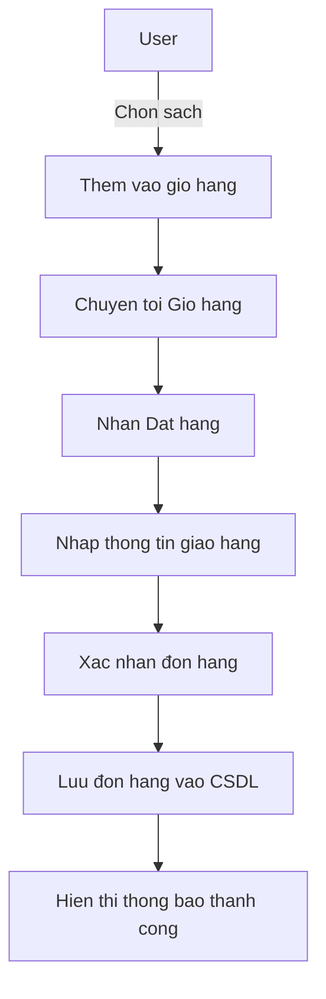
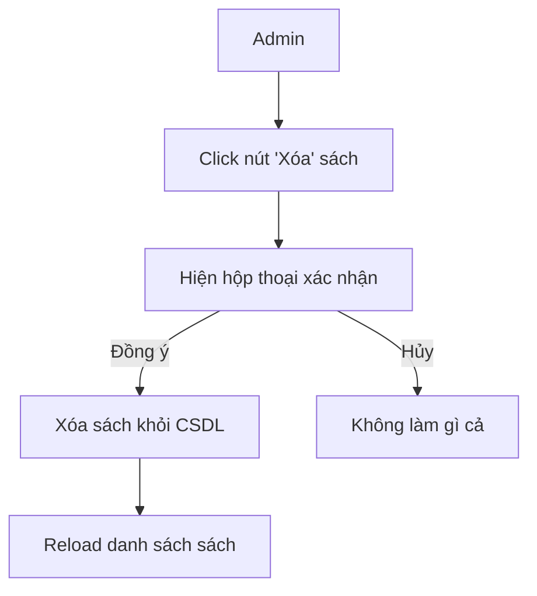
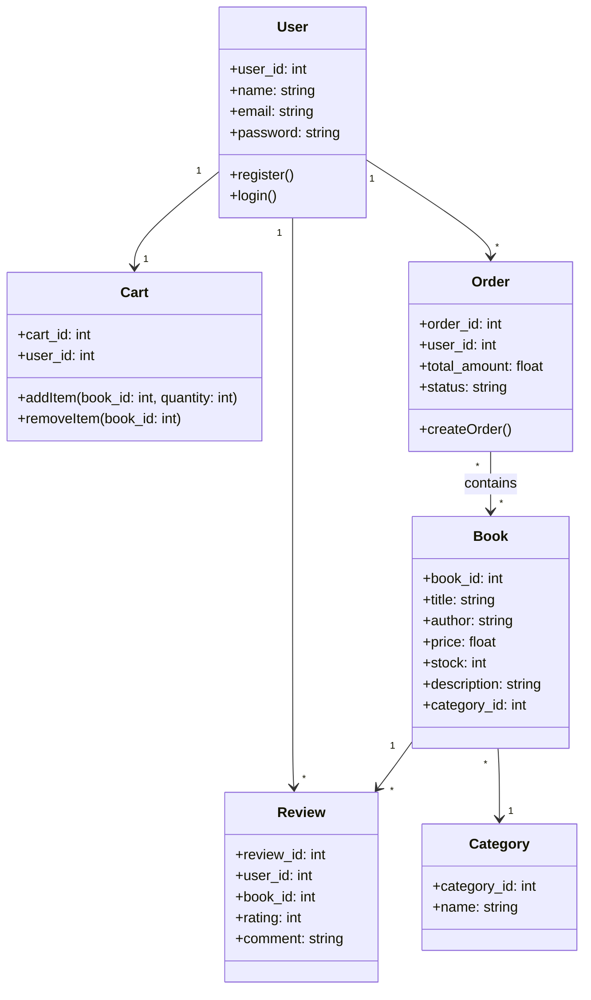

<h1>About us</h1>
<ul>
    <a href = 'https://github.com/Khanhs3043' ><li>Nguyễn Thị Thu Giang - 23010871</li></a>
    <a href = 'https://github.com/nguyendieulinh03' ><li>Ngô Thị Minh Phương - 23012156</li></a>
</ul>

We're all from PHENIKAA UNIVERSITY

# Shop-Ban-Sach-Laravel
# Thông tin về project:
    -Là một trang web bán sách trực tuyến được xây dựng bằng Laravel.
    -Người dùng có thể đăng ký, đăng nhập, xem danh sách sách, tìm kiếm, thêm vào giỏ hàng và đặt hàng.
    -Quản trị viên (Admin) có thể quản lý sách, danh mục, người dùng và đơn hàng.
    -Hệthống sử dụng các models chính như: User, Book, Cart, Order, Review, Category.
    -Hướng tới thiết kế MVC rõ ràng, dễ mở rộng trong tương lai.

## Activity Diagram (Ví dụ: Đặt hàng - Place Order)

## Activity Diagram (Ví dụ: Xoá sách - Admin)

## Class Diagram (Phiên bản rút gọn)

